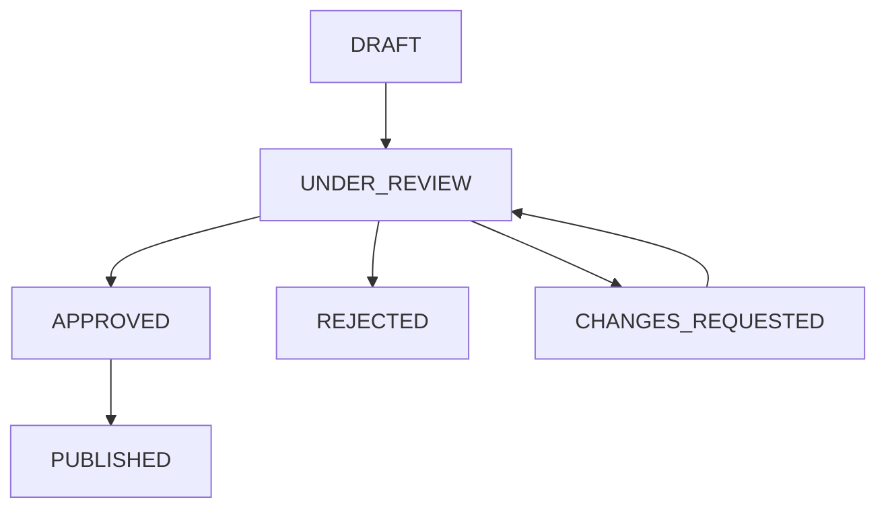

# Content Approval API Documentation

This document provides comprehensive documentation for the Content Approval Workflow API endpoints.

## Base Information

- **Base URL**: `http://localhost:8088`
- **Content Type**: `application/json`
- **API Version**: `1.0.0`
- **OpenAPI Spec**: Available at `/q/openapi`
- **Interactive Documentation**: Available at `/q/swagger-ui/`

## Authentication

Currently, the API does not require authentication. In a production environment, you would typically implement:

- JWT-based authentication
- Role-based access control (RBAC)
- API key authentication

## Content Management Endpoints

### Submit Content for Approval

Initiates a new content approval workflow.

**Endpoint**: `POST /content`

**Request Body**:
```json
{
  "title": "string (required, 5-255 characters)",
  "content": "string (required, 50-50000 characters)",
  "authorId": "string (required)",
  "tags": ["string"] (optional)
}
```

**Example Request**:
```bash
curl -X POST http://localhost:8088/content \
  -H "Content-Type: application/json" \
  -d '{
    "title": "Understanding Temporal Workflows",
    "content": "Temporal provides a powerful way to build reliable, scalable applications by handling the complexities of distributed systems. In this comprehensive guide, we will explore the core concepts of Temporal workflows, their benefits, and practical implementation strategies.",
    "authorId": "john.doe@example.com",
    "tags": ["temporal", "workflow", "distributed-systems", "tutorial"]
  }'
```

**Success Response** (`200 OK`):
```json
{
  "contentId": 123,
  "workflowId": "content-approval-123-1703616000000",
  "status": "SUBMITTED",
  "message": "Content submitted successfully for approval",
  "submittedAt": "2024-12-16T10:30:00Z"
}
```

**Error Response** (`400 Bad Request`):
```json
{
  "contentId": null,
  "workflowId": null,
  "status": "ERROR",
  "message": "Content validation failed: Title must be between 5 and 255 characters"
}
```

### Get Content Status

Retrieves the current status of content in the approval workflow.

**Endpoint**: `GET /content/{contentId}/status`

**Path Parameters**:
- `contentId` (integer, required): The unique identifier of the content

**Example Request**:
```bash
curl http://localhost:8088/content/123/status
```

**Success Response** (`200 OK`):
```json
{
  "contentId": 123,
  "workflowId": "content-approval-123-1703616000000",
  "status": "UNDER_REVIEW",
  "authorId": "john.doe@example.com",
  "currentReviewerId": null,
  "isComplete": false,
  "submittedAt": "2024-12-16T10:30:00Z",
  "reviewStartedAt": "2024-12-16T10:30:05Z",
  "completedAt": null,
  "revisionCount": 0,
  "approvalComments": null,
  "rejectionReason": null,
  "changeRequests": null
}
```

**Not Found Response** (`404 Not Found`):
```json
{
  "contentId": 999,
  "status": "NOT_FOUND"
}
```

### Approve Content

Approves content in the approval workflow.

**Endpoint**: `POST /content/{contentId}/approve`

**Path Parameters**:
- `contentId` (integer, required): The unique identifier of the content

**Query Parameters**:
- `approverId` (string, required): The identifier of the approver
- `comments` (string, optional): Approval comments

**Example Request**:
```bash
curl -X POST "http://localhost:8088/content/123/approve?approverId=jane.reviewer@example.com&comments=Excellent%20article%20with%20clear%20explanations"
```

**Success Response** (`200 OK`):
```json
{
  "message": "Content approval signal sent successfully"
}
```

**Error Response** (`400 Bad Request`):
```json
{
  "error": "Approver ID is required"
}
```

**Error Response** (`400 Bad Request` - Invalid State):
```json
{
  "error": "Failed to send approval signal"
}
```

### Reject Content

Rejects content in the approval workflow.

**Endpoint**: `POST /content/{contentId}/reject`

**Path Parameters**:
- `contentId` (integer, required): The unique identifier of the content

**Query Parameters**:
- `reviewerId` (string, required): The identifier of the reviewer
- `reason` (string, optional): Reason for rejection

**Example Request**:
```bash
curl -X POST "http://localhost:8088/content/123/reject?reviewerId=jane.reviewer@example.com&reason=Content%20needs%20more%20detailed%20examples"
```

**Success Response** (`200 OK`):
```json
{
  "message": "Content rejection signal sent successfully"
}
```

**Error Response** (`400 Bad Request`):
```json
{
  "error": "Reviewer ID is required"
}
```

### Request Changes

Requests changes for content in the approval workflow.

**Endpoint**: `POST /content/{contentId}/request-changes`

**Path Parameters**:
- `contentId` (integer, required): The unique identifier of the content

**Query Parameters**:
- `reviewerId` (string, required): The identifier of the reviewer
- `changeRequests` (string, required): Description of requested changes

**Example Request**:
```bash
curl -X POST "http://localhost:8088/content/123/request-changes?reviewerId=jane.reviewer@example.com&changeRequests=Please%20add%20more%20code%20examples%20and%20improve%20the%20conclusion"
```

**Success Response** (`200 OK`):
```json
{
  "message": "Change request signal sent successfully"
}
```

**Error Response** (`400 Bad Request`):
```json
{
  "error": "Change requests are required"
}
```

## Content Status Values

The `status` field can have the following values:

| Status | Description |
|--------|-------------|
| `DRAFT` | Content is in draft state, not yet submitted |
| `UNDER_REVIEW` | Content has been submitted and is under review |
| `APPROVED` | Content has been approved by a reviewer |
| `PUBLISHED` | Content has been published and is live |
| `REJECTED` | Content has been rejected and cannot be published |
| `CHANGES_REQUESTED` | Content requires changes before approval |

## Workflow State Transitions



## Health and Monitoring Endpoints

### Application Health

**Endpoint**: `GET /q/health`

**Response**:
```json
{
  "status": "UP",
  "checks": [
    {
      "name": "Database connection health check",
      "status": "UP"
    },
    {
      "name": "Temporal connection health check", 
      "status": "UP"
    }
  ]
}
```

### Liveness Probe

**Endpoint**: `GET /q/health/live`

**Response**:
```json
{
  "status": "UP",
  "checks": []
}
```

### Readiness Probe

**Endpoint**: `GET /q/health/ready`

**Response**:
```json
{
  "status": "UP",
  "checks": [
    {
      "name": "Database connection health check",
      "status": "UP"
    }
  ]
}
```

## Error Handling

### Error Response Format

All error responses follow a consistent format:

```json
{
  "error": "string",
  "message": "string", 
  "timestamp": "ISO-8601 timestamp",
  "path": "API endpoint path"
}
```

### HTTP Status Codes

| Status Code | Description |
|-------------|-------------|
| `200` | Success |
| `400` | Bad Request - Invalid input data |
| `404` | Not Found - Content does not exist |
| `500` | Internal Server Error - Server-side error |

### Common Error Scenarios

1. **Validation Errors**: Invalid input data (title too short, content too long, etc.)
2. **Workflow State Errors**: Attempting invalid state transitions
3. **Not Found Errors**: Requesting status of non-existent content
4. **Missing Parameters**: Required query parameters not provided

## Rate Limiting

Currently, no rate limiting is implemented. In production, consider implementing:

- Per-IP rate limiting
- Per-user rate limiting
- API endpoint-specific limits

## Integration Examples

### Java Client Example

```java
// Using Java HTTP Client
HttpClient client = HttpClient.newHttpClient();

// Submit content
String requestBody = """
{
  "title": "My Article",
  "content": "Article content here...",
  "authorId": "author@example.com",
  "tags": ["java", "tutorial"]
}
""";

HttpRequest request = HttpRequest.newBuilder()
    .uri(URI.create("http://localhost:8088/content"))
    .header("Content-Type", "application/json")
    .POST(HttpRequest.BodyPublishers.ofString(requestBody))
    .build();

HttpResponse<String> response = client.send(request, 
    HttpResponse.BodyHandlers.ofString());
```

### JavaScript/TypeScript Example

```typescript
// Submit content
const response = await fetch('http://localhost:8088/content', {
  method: 'POST',
  headers: {
    'Content-Type': 'application/json',
  },
  body: JSON.stringify({
    title: 'My Article',
    content: 'Article content here...',
    authorId: 'author@example.com',
    tags: ['javascript', 'tutorial']
  })
});

const result = await response.json();
console.log('Content submitted:', result);

// Check status
const statusResponse = await fetch(`http://localhost:8088/content/${result.contentId}/status`);
const status = await statusResponse.json();
console.log('Current status:', status);
```

### Python Example

```python
import requests

# Submit content
payload = {
    "title": "My Article",
    "content": "Article content here...",
    "authorId": "author@example.com",
    "tags": ["python", "tutorial"]
}

response = requests.post(
    "http://localhost:8088/content",
    json=payload,
    headers={"Content-Type": "application/json"}
)

result = response.json()
print(f"Content submitted: {result}")

# Check status
status_response = requests.get(f"http://localhost:8088/content/{result['contentId']}/status")
status = status_response.json()
print(f"Current status: {status}")
```

## OpenAPI Specification

The complete OpenAPI specification is available at:
- **JSON**: `http://localhost:8088/q/openapi`
- **YAML**: `http://localhost:8088/q/openapi?format=yaml`
- **Interactive UI**: `http://localhost:8088/q/swagger-ui/`

This specification can be used to generate client libraries in various programming languages using tools like:
- OpenAPI Generator
- Swagger Codegen
- Postman Collection import

## Support and Troubleshooting

For API-related issues:

1. **Check the Swagger UI** for interactive testing
2. **Verify content validation** using the validation rules
3. **Monitor health endpoints** for service status
4. **Check application logs** for detailed error information
5. **Use the Temporal UI** at `http://localhost:8081` to inspect workflow execution