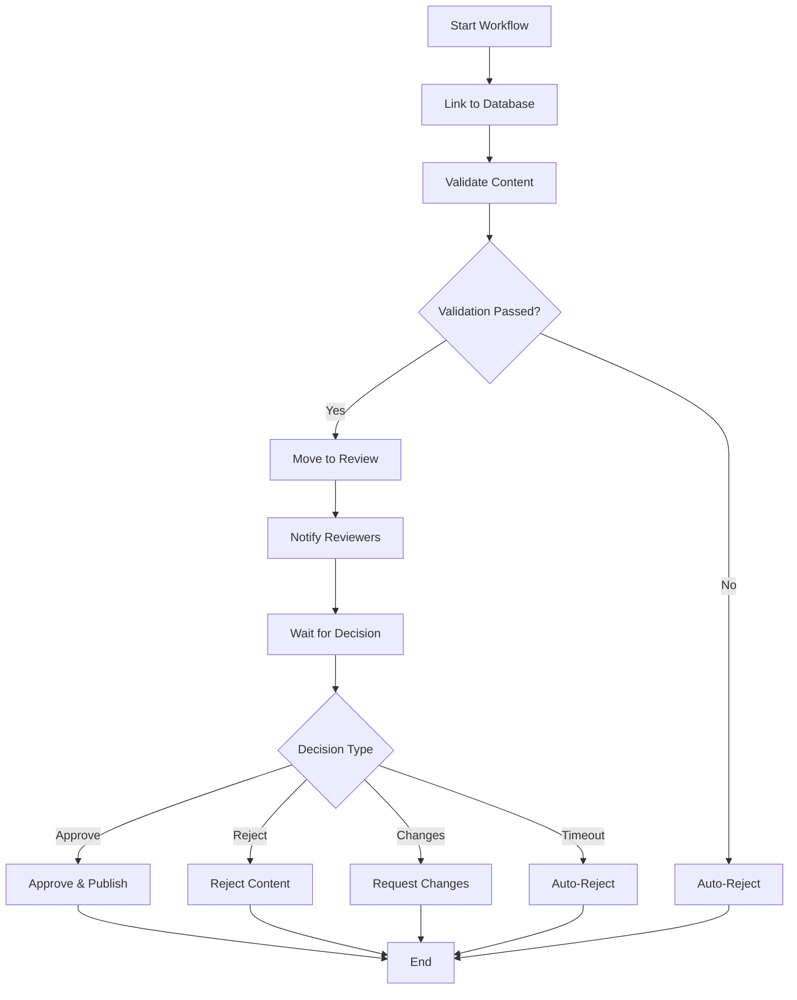

# Temporal Workflow Guide

This document provides comprehensive guidance on understanding, extending, and troubleshooting Temporal workflows in the Content Approval system.

## Overview

The Content Approval system uses Temporal to orchestrate long-running, fault-tolerant workflows that manage the entire content approval lifecycle. This guide covers the implementation details, best practices, and troubleshooting for the Temporal integration.

## Workflow Architecture

### Core Components

1. **Workflows**: Define the approval process logic
2. **Activities**: Perform individual tasks (validation, persistence, notifications)
3. **Workers**: Execute workflows and activities
4. **Signals**: External events that modify workflow state
5. **Queries**: Read workflow state without modification

### Content Approval Workflow



## Workflow Implementation

### Workflow Interface

```java
@WorkflowInterface
public interface ContentApprovalWorkflow {
    
    @WorkflowMethod(name = "ContentApproval")
    String processContentApproval(Long contentId, String authorId);
    
    @SignalMethod
    void approve(String approverId, String comments);
    
    @SignalMethod
    void reject(String reviewerId, String reason);
    
    @SignalMethod
    void requestChanges(String reviewerId, String changeRequests);
    
    @QueryMethod
    ContentApprovalState getWorkflowState();
    
    @QueryMethod
    String getApprovalStatus();
    
    @QueryMethod
    boolean isComplete();
}
```

### Key Implementation Details

#### Deterministic Execution

```java
// ✅ Correct - Using Workflow.currentTimeMillis()
LocalDateTime now = LocalDateTime.ofInstant(
    Instant.ofEpochMilli(Workflow.currentTimeMillis()), 
    ZoneOffset.UTC
);

// ❌ Incorrect - Non-deterministic
LocalDateTime now = LocalDateTime.now(); // This would cause replay failures
```

#### Activity Configuration

```java
// Configure activities with proper timeouts and retry policies
ActivityOptions shortActivityOptions = ActivityOptions.newBuilder()
    .setStartToCloseTimeout(Duration.ofMinutes(5))
    .setRetryOptions(RetryOptions.newBuilder()
        .setMaximumAttempts(3)
        .setInitialInterval(Duration.ofSeconds(1))
        .setMaximumInterval(Duration.ofSeconds(30))
        .setBackoffCoefficient(2.0)
        .build())
    .build();
```

#### Signal Handling

```java
@Override
public void approve(String approverId, String comments) {
    logger.info("Approval signal received from {}: {}", approverId, comments);
    
    if (workflowState != null && workflowState.getStatus().canBeApproved()) {
        workflowState.approve(approverId, comments);
        approvalReceived = true;
        logger.info("Content approval processed for reviewer: {}", approverId);
    } else {
        logger.warn("Approval signal ignored - content not in approvable state: {}", 
            workflowState != null ? workflowState.getStatus() : "null");
    }
}
```

#### Timeout Handling

```java
// Wait for approval decision with timeout
Duration reviewTimeout = Duration.ofDays(7); // 7 days for review
boolean decisionReceived = Workflow.await(reviewTimeout, 
    () -> approvalReceived || rejectionReceived || changesRequested);

if (!decisionReceived) {
    // Auto-reject after timeout
    workflowState.reject("system", "Review timeout exceeded");
    persistenceActivity.updateContentStatus(contentId, ContentStatus.REJECTED.getDatabaseValue());
    notificationActivity.notifyAuthor(authorId, "Content Review Timeout", 
        "Your content review has timed out and has been automatically rejected.");
}
```

## Activity Implementation

### Activity Interface Design

```java
@ActivityInterface
public interface ContentValidationActivity {
    
    @ActivityMethod
    boolean validateContent(Long contentId);
    
    @ActivityMethod
    boolean validateTitle(Long contentId);
    
    @ActivityMethod
    int calculateQualityScore(Long contentId);
    
    @ActivityMethod
    boolean checkContentAppropriateFor(Long contentId);
}
```

### Activity Best Practices

#### Idempotency

All activities must be idempotent - calling them multiple times should have the same effect:

```java
@Override
public void updateContentStatus(Long contentId, String status) {
    try {
        Activity.getExecutionContext().heartbeat("Updating content status");
        
        // Idempotent operation - safe to retry
        int updated = dsl.update(CONTENT)
                .set(CONTENT.STATUS, status)
                .set(CONTENT.UPDATED_DATE, LocalDateTime.now())
                .where(CONTENT.ID.eq(contentId))
                .execute();
        
        if (updated == 0) {
            throw new RuntimeException("Content not found with ID: " + contentId);
        }
        
    } catch (Exception e) {
        logger.error("Error updating content {} status to {}", contentId, status, e);
        throw new RuntimeException("Failed to update content status", e);
    }
}
```

#### Heartbeats

Use heartbeats for long-running activities:

```java
@Override
public boolean validateContent(Long contentId) {
    try {
        // Send heartbeat to indicate progress
        Activity.getExecutionContext().heartbeat("Starting content validation");
        
        // Perform validation logic...
        boolean titleValid = validateTitleInternal(content.getTitle());
        
        Activity.getExecutionContext().heartbeat("Title validation completed");
        
        boolean contentValid = validateContentInternal(content.getContent());
        
        Activity.getExecutionContext().heartbeat("Content validation completed");
        
        return titleValid && contentValid;
        
    } catch (Exception e) {
        logger.error("Error validating content with ID: {}", contentId, e);
        throw new RuntimeException("Content validation failed", e);
    }
}
```

#### Error Classification

```java
// Retryable errors - temporary failures
public class RetryableValidationException extends RuntimeException {
    public RetryableValidationException(String message, Throwable cause) {
        super(message, cause);
    }
}

// Non-retryable errors - permanent failures
public class NonRetryableValidationException extends RuntimeException {
    public NonRetryableValidationException(String message) {
        super(message);
    }
}
```

## Worker Configuration

### Worker Setup

```java
@ApplicationScoped
public class TemporalWorkerConfig {
    
    public static final String CONTENT_APPROVAL_TASK_QUEUE = "content-approval-queue";
    
    void onStart(@Observes StartupEvent event) {
        // Configure worker options for optimal performance
        WorkerOptions workerOptions = WorkerOptions.newBuilder()
                .setMaxConcurrentActivityExecutionSize(100)
                .setMaxConcurrentWorkflowTaskExecutionSize(50)
                .setMaxConcurrentLocalActivityExecutionSize(200)
                .build();
        
        // Create worker for content approval task queue
        Worker contentApprovalWorker = workerFactory.newWorker(CONTENT_APPROVAL_TASK_QUEUE, workerOptions);
        
        // Register workflow implementations
        contentApprovalWorker.registerWorkflowImplementationTypes(ContentApprovalWorkflowImpl.class);
        
        // Register activity implementations
        contentApprovalWorker.registerActivitiesImplementations(
            contentValidationActivity,
            contentPersistenceActivity,
            notificationActivity
        );
        
        // Start the worker factory
        workerFactory.start();
    }
}
```

### Performance Tuning

#### Worker Options

```java
WorkerOptions workerOptions = WorkerOptions.newBuilder()
    // Maximum number of activities executed concurrently
    .setMaxConcurrentActivityExecutionSize(200)
    
    // Maximum number of workflow tasks executed concurrently
    .setMaxConcurrentWorkflowTaskExecutionSize(100)
    
    // Maximum number of local activities executed concurrently
    .setMaxConcurrentLocalActivityExecutionSize(500)
    
    // Enable sticky execution for better performance
    .setStickyQueueScheduleToStartTimeout(Duration.ofSeconds(10))
    .build();
```

#### Connection Tuning

```properties
# Temporal connection optimization
quarkus.temporal.connection.enable-keep-alive=true
quarkus.temporal.connection.keep-alive-time=PT30S
quarkus.temporal.connection.keep-alive-timeout=PT5S
quarkus.temporal.connection.keep-alive-without-calls=true
quarkus.temporal.connection.max-grpc-inbound-message-size=52428800
```

## Testing Strategies

### Unit Testing with TestWorkflowEnvironment

```java
@Test
public void testSuccessfulApprovalFlow() {
    TestWorkflowEnvironment testEnv = TestWorkflowEnvironment.newInstance();
    Worker worker = testEnv.newWorker(TASK_QUEUE);
    
    // Mock activities
    ContentValidationActivity mockValidation = mock(ContentValidationActivity.class);
    ContentPersistenceActivity mockPersistence = mock(ContentPersistenceActivity.class);
    NotificationActivity mockNotification = mock(NotificationActivity.class);
    
    // Configure mock behavior
    when(mockValidation.validateContent(anyLong())).thenReturn(true);
    doNothing().when(mockPersistence).linkContentToWorkflow(anyLong(), anyString());
    
    // Register workflow and activities
    worker.registerWorkflowImplementationTypes(ContentApprovalWorkflowImpl.class);
    worker.registerActivitiesImplementations(mockValidation, mockPersistence, mockNotification);
    testEnv.start();
    
    // Create workflow stub
    ContentApprovalWorkflow workflow = testEnv.getWorkflowClient()
            .newWorkflowStub(ContentApprovalWorkflow.class, 
                WorkflowOptions.newBuilder().setTaskQueue(TASK_QUEUE).build());
    
    // Test workflow execution
    WorkflowClient.start(workflow::processContentApproval, 1L, "testAuthor");
    testEnv.sleep(Duration.ofSeconds(1));
    
    // Send approval signal
    workflow.approve("reviewer1", "Looks good!");
    testEnv.sleep(Duration.ofSeconds(1));
    
    // Verify final state
    ContentApprovalState state = workflow.getWorkflowState();
    assertEquals(ContentStatus.PUBLISHED, state.getStatus());
    assertTrue(state.isComplete());
}
```

### Integration Testing

```java
@QuarkusTest
@TestProfile(IntegrationTestProfile.class)
public class ContentApprovalE2ETest {
    
    @Test
    public void testCompleteApprovalWorkflow() throws InterruptedException {
        // Submit content via REST API
        ContentSubmissionRequest request = new ContentSubmissionRequest(
            "Test Article", "Content for testing...", "test-author"
        );
        
        ContentApprovalResponse response = given()
            .contentType(ContentType.JSON)
            .body(request)
            .when()
            .post("/content")
            .then()
            .statusCode(200)
            .extract()
            .as(ContentApprovalResponse.class);
        
        // Wait for workflow to process
        Thread.sleep(2000);
        
        // Approve content
        given()
            .queryParam("approverId", "test-reviewer")
            .queryParam("comments", "Approved!")
            .when()
            .post("/content/{id}/approve", response.getContentId())
            .then()
            .statusCode(200);
        
        // Verify final status
        Thread.sleep(2000);
        given()
            .when()
            .get("/content/{id}/status", response.getContentId())
            .then()
            .statusCode(200)
            .body("status", equalTo("PUBLISHED"));
    }
}
```

## Monitoring and Observability

### Workflow Metrics

```java
// Custom metrics for workflow monitoring
@Inject
MeterRegistry meterRegistry;

public void recordWorkflowStart(String workflowType) {
    meterRegistry.counter("temporal.workflow.started", "type", workflowType).increment();
}

public void recordWorkflowCompletion(String workflowType, String status) {
    meterRegistry.counter("temporal.workflow.completed", 
        "type", workflowType, "status", status).increment();
}
```

### Workflow Search Attributes

```java
// Set search attributes for workflow discoverability
Map<String, Object> searchAttributes = new HashMap<>();
searchAttributes.put("AuthorId", authorId);
searchAttributes.put("ContentType", "article");
searchAttributes.put("Priority", "normal");

WorkflowOptions options = WorkflowOptions.newBuilder()
    .setWorkflowId(workflowId)
    .setTaskQueue(CONTENT_APPROVAL_TASK_QUEUE)
    .setSearchAttributes(searchAttributes)
    .build();
```

### Temporal UI Integration

Access the Temporal UI at `http://localhost:8081` to:

1. **Monitor workflow executions** - View running, completed, and failed workflows
2. **Inspect workflow history** - See detailed event history
3. **Query workflows** - Search by workflow ID, type, or search attributes
4. **Terminate workflows** - Cancel stuck or erroneous workflows
5. **Replay workflows** - Test workflow changes against historical executions

## Troubleshooting

### Common Issues

#### 1. Workflow Stuck in Running State

**Symptoms**: Workflow appears to be running but not progressing

**Causes**:
- Worker not running or not registered for the task queue
- Activity timeout without proper error handling
- Deadlock in workflow logic

**Solutions**:
```bash
# Check worker status
curl http://localhost:8088/q/health

# Verify task queue in Temporal UI
# Check worker logs for errors
```

#### 2. Non-Deterministic Workflow Errors

**Symptoms**: Workflow fails with "non-deterministic" error messages

**Causes**:
- Using `System.currentTimeMillis()` instead of `Workflow.currentTimeMillis()`
- Random number generation in workflow code
- Non-deterministic conditionals

**Solutions**:
```java
// Use Workflow utilities for deterministic operations
Workflow.currentTimeMillis()    // Instead of System.currentTimeMillis()
Workflow.getLogger()           // Instead of LoggerFactory.getLogger()
Workflow.newRandom()           // For deterministic random numbers
```

#### 3. Activity Timeout Issues

**Symptoms**: Activities timing out frequently

**Causes**:
- Incorrect timeout configuration
- Database connection issues
- External service delays

**Solutions**:
```java
// Adjust activity timeouts
ActivityOptions options = ActivityOptions.newBuilder()
    .setStartToCloseTimeout(Duration.ofMinutes(10))  // Increase timeout
    .setHeartbeatTimeout(Duration.ofSeconds(30))     // Add heartbeat
    .setRetryOptions(RetryOptions.newBuilder()
        .setMaximumAttempts(5)                       // Increase retries
        .build())
    .build();
```

#### 4. Database Connection Pool Exhaustion

**Symptoms**: Activities failing with connection pool errors

**Solutions**:
```properties
# Increase connection pool size
quarkus.datasource.jdbc.max-size=50
quarkus.datasource.jdbc.acquisition-timeout=PT60S

# Monitor connection usage
quarkus.datasource.metrics.enabled=true
```

### Debugging Workflows

#### Enable Debug Logging

```properties
# Enable debug logging for Temporal
quarkus.log.category."io.temporal.internal".level=DEBUG
quarkus.log.category."com.wcygan.contentapproval.workflow".level=DEBUG
```

#### Workflow Replay Testing

```java
@Test
public void testWorkflowReplay() {
    // Get workflow execution history
    String workflowId = "content-approval-123-1703616000000";
    
    WorkflowReplayer.replayWorkflowExecution(
        workflowHistory,
        ContentApprovalWorkflowImpl.class
    );
}
```

### Performance Optimization

#### Batch Processing

```java
// Batch database operations in activities
@Override
public void processBulkUpdates(List<ContentUpdate> updates) {
    // Use batch operations for better performance
    dsl.batch(
        updates.stream()
            .map(update -> dsl.update(CONTENT)
                .set(CONTENT.STATUS, update.getStatus())
                .where(CONTENT.ID.eq(update.getId())))
            .collect(Collectors.toList())
    ).execute();
}
```

#### Local Activities

```java
// Use local activities for simple, fast operations
@Override
public String processContentApproval(Long contentId, String authorId) {
    // Use local activity for simple validations
    String result = Workflow.newLocalActivityStub(
        SimpleValidationActivity.class,
        LocalActivityOptions.newBuilder()
            .setStartToCloseTimeout(Duration.ofSeconds(10))
            .build()
    ).validateBasicFormat(contentId);
    
    // Use regular activity for complex operations
    validationActivity.validateContent(contentId);
}
```

## Best Practices Summary

### Workflow Design
1. **Keep workflows simple** - Complex logic should be in activities
2. **Use signals sparingly** - Prefer queries for state inspection
3. **Handle timeouts gracefully** - Always have timeout handling
4. **Version workflows carefully** - Use `Workflow.getVersion()` for changes

### Activity Design
1. **Make activities idempotent** - Safe to retry multiple times
2. **Use appropriate timeouts** - Based on expected execution time
3. **Send heartbeats** - For long-running operations
4. **Handle errors properly** - Classify retryable vs non-retryable

### Performance
1. **Optimize worker configuration** - Based on expected load
2. **Use connection pooling** - For database and external services
3. **Monitor metrics** - Track workflow and activity performance
4. **Batch operations** - When processing multiple items

### Testing
1. **Use TestWorkflowEnvironment** - For fast unit tests
2. **Mock activities** - Isolate workflow logic testing
3. **Test failure scenarios** - Verify error handling
4. **Test replay compatibility** - Ensure deterministic execution